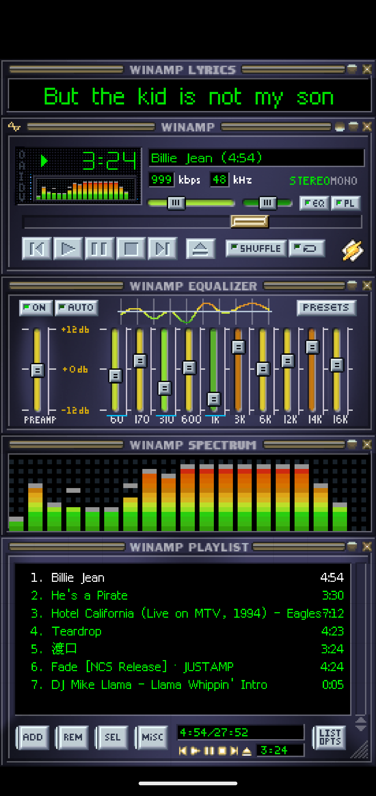
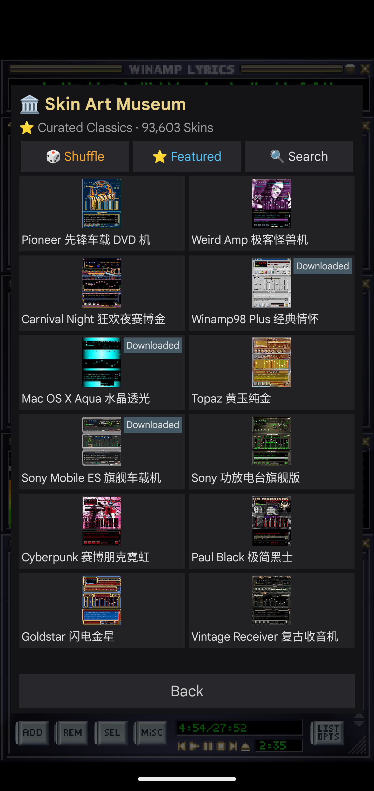
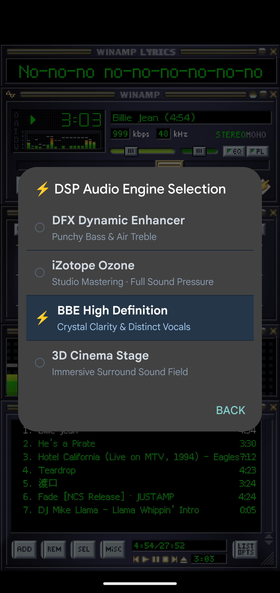
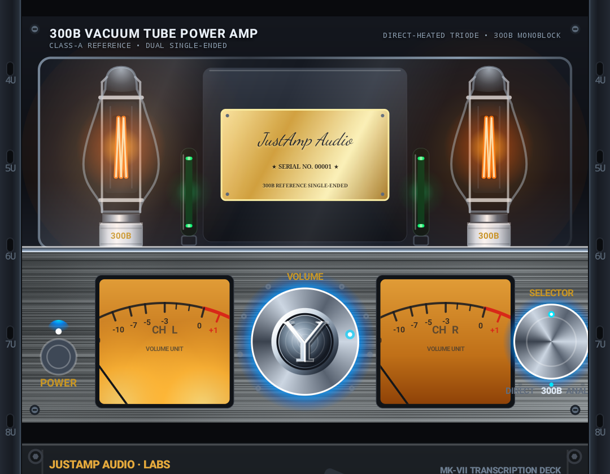
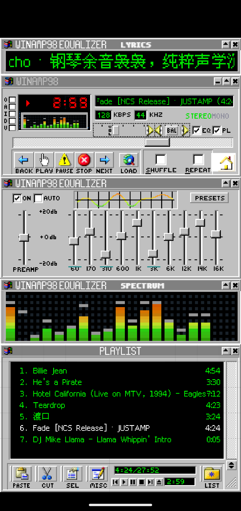
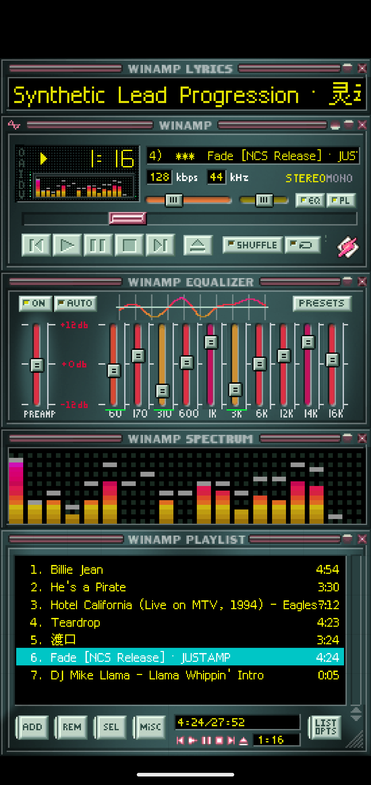
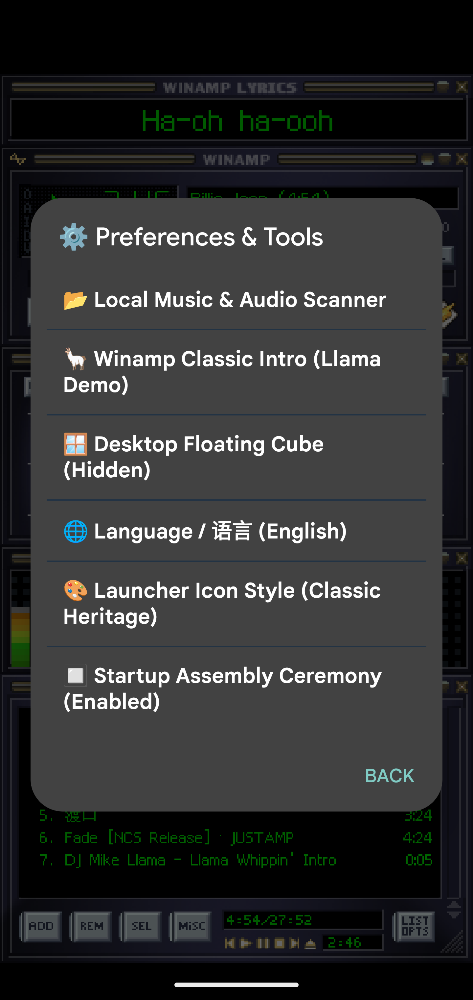

# JUSTAMP · 忆系列

**The green glow is back. A pixel-faithful Winamp 2.91 tribute player for Android — 93,603 classic skins, four legendary DSP engines, zero ads, zero paywalls.**

English | [简体中文](README.zh-CN.md)

  

Some things shouldn't be washed away by time.

In 1997, a little player called Winamp threw a green waveform into the dark of a million bedrooms. Listening to music was a ritual back then: double-click the icon, watch the rack light up, see the spectrum bars dance with the drums. Thirty years later, interfaces went flat, music got stuffed into cloud algorithms, and players became content shelves.

JUSTAMP isn't chasing that. It brings that era back, exactly as it was, onto the screen in your hand.

## A Re-Creation, Not a Reskin

JUSTAMP is rebuilt from the ground up after Winamp 2.91 — an original clean-room implementation, fully compatible with the Winamp classic skin format. The main panel, graphic equalizer, spectrum analyzer, and playlist editor are restored pixel by pixel, down to the damping of the sliders, the highlight when a button is pressed, and the green-to-red gradient of the spectrum columns. Every control moves the way it did back then.

Balance, EQ, PL, SHUFFLE, REPEAT — everything sits exactly where you remember.

## Legendary Sound: Four Switchable DSP Engines

Four real, switchable DSP engines take effect in real time — no restart, no audio gap:

- **DFX Dynamic Enhancement** — punchy bass with airy highs; still the crowd favorite decades later
- **iZotope Ozone** — studio mastering texture with full sonic pressure
- **BBE High-Definition Clarity** — crystalline transparency; vocals step out of the mix
- **3D Cinema Surround** — a wide surround field built for car stereos and big speakers

Paired with a true retro 10-band hardware-style equalizer (60Hz – 16kHz, ±12dB) and **18 factory presets** — Classical, Club, Dance, Rock, Pop, Hall, Party, Live, Techno… the original names, untouched. Push the bands yourself, tune the PREAMP separately. The DSP master switch is the lightning bolt on the main panel: powered off, everything bypasses with zero noise floor; powered on, the whole rack comes alive. Plus millisecond-precise lyrics sync adjustment.

## Skins: 93,603 — A Cloud Art Museum

Skins are the most beloved legacy of the classic player. JUSTAMP is 100% compatible with the native classic skin format and connects directly to a cloud skin museum with **93,603 works**:

- **Curated hall** — official picks; you can't go wrong
- **Random blind box** — roll the dice across 93k skins; every change is a surprise
- **Keyword search** — try Pioneer, Sony, Mac, Cyber… type a word and an era's aesthetic comes back

Pick one, download it, wear it. The active skin gets marked.

Nothing catches your eye? The built-in **recolor workshop** offers 5 color themes — Ice Blue, Dusk Violet, Rust Red, Sunset, Emerald — plus a 0°–359° custom hue slider that recolors an entire skin while preserving brightness relationships. Got .wsz / .zip skin packs saved up? Install them directly. Local skins can be managed and uninstalled; deleting them returns you to the factory base-2.91 look — JUSTAMP's default face.

## Lyrics — The Panel Winamp Never Had

The original Winamp never gave you lyrics. JUSTAMP does: a dedicated lyrics rack synced to the millisecond, with a fine-tune offset slider so the words land exactly on the beat. Embedded tags, sidecar .lrc files, and online sources are all supported.

## Library & Playlists: For Offline Listeners

- **Local library scan** — one tap to index on-device audio (MediaStore), or import by folder
- **Playlist health check** — automatically clears dead links and fixes track names after your library moves phones
- **One-tap dedupe, sort by title, playlist export** — keeping a playlist tidy taken seriously

JUSTAMP does no video, no social feed, no live streaming. Open it and it's a player; close it and nothing lingers in the background.

## Desktop & Personality

- **Floating mini player** — a tiny deck floating on your home screen; skip tracks without re-entering the app (opt-in overlay permission)
- **Shortcut icon styles** — the classic tribute gold badge, or a modern silver unibody with dual VU meters; switch freely
- **Unboxing ceremony** — every launch replays a little assembly show; can be turned off for a clean start
- **Languages** — Simplified Chinese / Traditional Chinese / English / follow system

## Geek Dignity: Zero Ads, Zero Paywalls (Classic)

The Classic player is 100% free and fully open. No gold padlocks, no "subscribe to unlock sound effects", no splash ads, no popups, no deliberately crippled features.

It's not a traffic product. It's a tool, a keepsake, and an answer to "how we used to listen to music."

## Hi-Fi Studio (Optional Paid Module)

For the audiophiles: a separate **Hi-Fi Studio** module stacks 9 physical-modeled rack modules — a glowing **300B single-ended tube power amp**, dual 6SN7 line stage, vinyl deck, reel-to-reel master tape, cassette deck, top-loading CD transport, analog FM tuner, 10-band studio EQ, and a binaural crossfeed DSP — freely stackable in any order.

**Not included in the Classic package.** The Full build ships with a built-in **30-day free trial**; after that, a one-time lifetime key (no subscription, ever) unlocks it permanently:

- 🌏 **Afdian** (WeChat Pay / Alipay): https://afdian.com/item/b801786eb6ce11f199705254001e7c00
- ☕ **Ko-fi** (PayPal / cards): https://ko-fi.com/s/36e9a73c42

## Easter Eggs

Double-tap the bottom-right corner of the main panel. Try it.

The playlist also ships with Winamp's original anthem — **DJ Mike Llama's "Llama Whippin' Intro"**. Press play and hear the declaration unchanged for thirty years: *Winamp, it really whips the llama's ass!*

## Download

Grab the APK from the [**Releases**](../../releases) page:

- **JUSTAMP Classic** — the pure retro player. Free forever, no strings.
- **JUSTAMP Full** — everything above plus the Hi-Fi Studio with a 30-day trial.

🇨🇳 国内用户下载镜像（免登录直链）：[Gitee Releases](https://gitee.com/yuxiaotao1982/JUSTAMP/releases)

**Requirements:** Android 7.0 (API 24) or higher. No account, no sign-in; audio permission only used to play your local music. See [PRIVACY.md](PRIVACY.md).

## Gallery

  

## Source Code

Source code is currently private; this repository is for releases and feedback. Bug reports and feature requests are welcome in [Issues](../../issues).

## Disclaimer

Winamp is a trademark of its respective owner. JUSTAMP is an independent tribute project, not affiliated with or endorsed by Winamp.

---

*"We are not the navigators of the era — then let us be its witnesses and recorders."*

**Yi Series (忆系列) · 2026**
